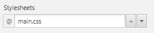

# module 120 docs

[TOC]

## get controller from a given resource

In a given controller:

```java
@FXML
private void handleOpen(ActionEvent event) throws IOException {
  FXMLLoader fxmlLoader = new FXMLLoader(getClass().getResource("Screen.fxml"));
  Parent root = (Parent)fxmlLoader.load();
  SomeController controller = fxmlLoader.getController();
  Stage stage = new Stage();
  stage.setScene(new Scene(root));
  stage.show();
  controller.setLabel(textarea.getText());
}
```

## create numbers leading with zeroes

```java
NumberFormat formatter = new DecimalFormat("00");  
String s = formatter.format(1); // -> 01
```

## random number between `min` and `max`

```java
public static int randInt(int min, int max) {
  Random rand = new Random();
  int randomNum = rand.nextInt((max - min) + 1) + min;
  return randomNum;
}
```

## compare two double values

`Double.compare()` returns `1` if equal and `-1` if not equal:

```java
if (Double.compare(0.8, 0.9) == -1) {
  // -> matches, because not equal
}
```

## simple observable values

* SimpleStringProperty
* SimpleDoubleProperty
* SimpleIntegerProperty

```java
class SomeClass {
  private SimpleDoubleProperty progress = new SimpleDoubleProperty(0.0);
  
  public SomeClass () {
    progress.set(0.1);
  }
}
```

## bind observables to the view

```java
// bind a string to a label
lable.textProperty().bind(model.getTextProperty());

// bind a double value to a progress indicator
progress.progressProperty().bind(model.getProgress());
```

## array lists

```java
public class Personen {
    List<Person> personen = new ArrayList<>();
  
    public Personen() {
        // Beispiel Daten. 
        personen.add(new Person("Hans", "Muster"));
        personen.add(new Person("Ruth", "Mueller"));
        personen.add(new Person("Heinz", "Kurz"));
        personen.add(new Person("Cornelia", "Meier"));
        personen.add(new Person("Werner", "Meyer"));
        personen.add(new Person("Lydia", "Kunz"));
        personen.add(new Person("Anna", "Best"));
        personen.add(new Person("Stefan", "Meier"));
        personen.add(new Person("Martin", "Mueller"));
    }

    public List<Person> getPersonen() {
        return personen;
    }

}
```

## dialogs

```java
// function to create information dialogs easily
static private void showInfoDialog(String headerText) {
  Alert alert = new Alert(AlertType.INFORMATION);
  alert.setTitle("Adressbook information");
  alert.setHeaderText(headerText);
  alert.showAndWait();
}
```

### pass information across stages

Where `person` is the information:

```java
private boolean initPersonViewDialog (Person person) throws IOException {
  FXMLLoader fxmlLoader = new FXMLLoader(getClass().getResource("View.fxml"));
  Parent root = (Parent) fxmlLoader.load();
  PersonViewController controller = fxmlLoader.getController();
  Stage stage = new Stage();
  stage.setScene(new Scene(root));

  // delegate to the controller the selected person so that it can be
  // displayed in the new view
  controller.setPerson(person);

  // set the stage so we can close the dialog from the controller
  controller.setStage(stage);

  // Show the dialog and wait until the user closes it
  stage.showAndWait();

  // return whether we want to commit/edit the person or not
  return controller.isCommitted();
}
```

## css

### load

Set the `.css` file in the scene builder under `Properties -> Stylesheets`. The path should be relative to the given `.fxml` scene:



### example

Whereas as `.root` is always tied to the upmost scene.

```css
.root{
    -fx-font-size: 9pt;
    -fx-font-family: "OpenSans";
    -fx-base: rgb(35, 122, 191);

}

.logo{
    -fx-background-image: url("main.png");
    -fx-background-position: top, right;
    -fx-background-repeat: no-repeat;
}

.ueberschrift{
    -fx-font-size: 1.2em;
    -fx-font-weight: bold;
}

.detailansicht{
    -fx-hgap: 10px;
    -fx-vgap: 5px;
    -fx-spacing: 20px;
}

.button:hover {
    -fx-background-color: white;
    -fx-text-fill: black;
}
```

## Observable lists

By default use `StringProperty` and `IntegerProperty` in every model and add getters for them like `firstNameProperty() -> StringProperty`.

**model.java**

```java
public class Person {
  private StringProperty name = new SimpleStringProperty("");

  public Person(String name) {
    this.name.setValue(name);
  }

  public StringProperty firstNameProperty() {
    return name;
  }
}
```

**controller.java**

```java
public class MainController implements Initializable {
  private ListView<Person> listView;
  private ObservableList<Person> persons;
  @FXML
  private TableView<Person> tableView;
  @FXML
  private TableColumn<Person, String> firstNameColumn;
  @FXML
  private TableColumn<Person, String> lastNameColumn;

  @Override
  public void initialize(URL url, ResourceBundle rb) {
    // create an observable list with some defaults
    persons = FXCollections.observableArrayList(new Persons().getPersons());
    
    // given the `setItems(object)` object, bind a value to a column
    firstNameColumn.setCellValueFactory(cellData -> cellData.getValue().firstNameProperty());
    lastNameColumn.setCellValueFactory(cellData -> cellData.getValue().lastNameProperty());
    
    // set the object persons into the tableview
    tableView.setItems(persons);
    // `tableView` is now reactive, so you can add entities into `persons` observableList
    persons.add(new Person("Florian", "Muellerson"));
  }
}
```

### on selection change, call function

```java
tableView
  .getSelectionModel().
  selectedItemProperty()
  .addListener((obs, oldValue, newValue) -> {
    someFunction(newValue);
  });
```
### get current selection index

```java
int index = tableView.getSelectionModel().getSelectedIndex();
```

